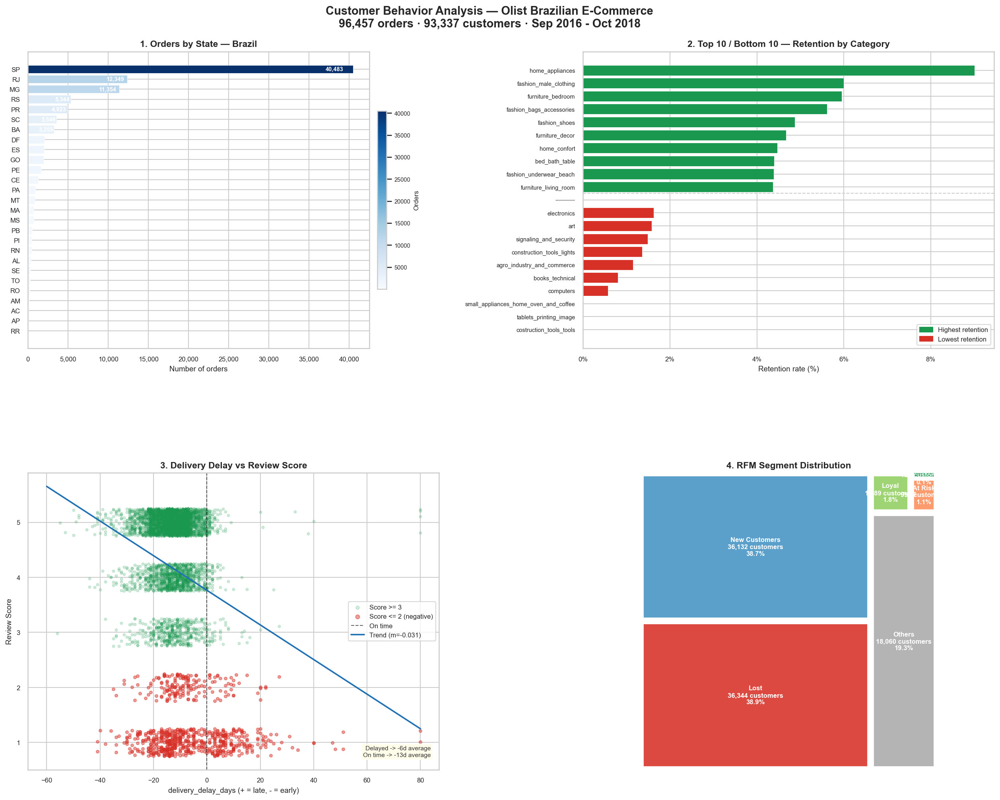

# Customer Behavior Analysis — Olist Brazilian E-Commerce (English mirror)

This is a full English mirror of the project's notebooks, SQL and dashboard. The root
[`README.md`](../README.md) is already written in English, but the notebook markdown, code
comments and the dashboard's Plotly labels were originally in Spanish. Everything under this
`english/` folder — notebooks, SQL, `load_data.py` and the dashboard — has been translated and
**re-executed independently** (its own `data/olist.db`, its own `dashboard/*.png` and
`dashboard_final.html`), and every number below has been read back from that re-execution and
checked against the original Spanish notebooks. They match exactly.

End-to-end data analysis project following the **CRISP-DM** methodology.  
Built for a **Berlin tech portfolio** — demonstrates SQL, Python, feature engineering, RFM segmentation and business storytelling on a real-world dataset.

**Dataset:** [Brazilian E-Commerce Public Dataset by Olist](https://www.kaggle.com/datasets/olistbr/brazilian-ecommerce) (Kaggle) — 100K orders, 2016–2018.



🖱️ **[Open the interactive Plotly dashboard](https://luciaparvaz.github.io/olist-customer-analysis/english/dashboard/dashboard_final.html)** — GitHub can't render the raw HTML file inline (it's several MB with `plotly.js` embedded), so it's served via GitHub Pages instead.

---

## Stack

| Layer | Tools |
|-------|-------|
| Language | Python 3.10 |
| Storage | SQLite (via `sqlite3` + SQLAlchemy) |
| Analysis | Pandas 2.2 · NumPy 1.26 |
| Visualization | Matplotlib 3.9 · Seaborn 0.13 · Plotly 5.22 |
| Notebooks | Jupyter 7.2 |
| SQL | CTEs · Window Functions · Aggregations |

---

## Project Structure

```
english/
├── data/                          # Raw CSVs + SQLite DB (not versioned)
├── sql/
│   ├── load_data.py               # Ingest CSVs → SQLite (9 tables)
│   ├── 02_data_preparation.sql    # 6-CTE master table query
│   └── 03_retention.sql           # 7-CTE retention + window functions
├── notebooks/
│   ├── 01_eda.ipynb               # Phase 2 — Data Understanding
│   ├── 02_data_prep.ipynb         # Phase 3 — Data Preparation
│   ├── 03_negative_reviews.ipynb  # Phase 4 — Negative Review Drivers
│   ├── 04_rfm_segmentation.ipynb  # Phase 4 — RFM Segmentation
│   └── 05_evaluation.ipynb        # Phase 5 — Evaluation & Recommendations
├── dashboard/                     # 06_dashboard.ipynb + 24 exported charts (PNG) + dashboard_final.html
└── README.md                      # this file
```

---

## Key Results

*(Same figures as the Spanish original — re-derived independently by re-running this English
pipeline end to end, not copied over.)*

### Customer Segmentation (RFM)

93,337 unique customers segmented using Recency · Frequency · Monetary. **Frequency is scored with
explicit business cuts, not automatic quintiles**: 97.0% of customers have exactly 1 order, so a
quintile split on Frequency ties nearly the whole base and breaks the tie by row order (effectively
random) — verified to produce segments statistically indistinguishable from noise (uniform average
Monetary score ≈3.0 across every segment). F_score is `1 order → 1`, `2 orders → 3`, `≥3 orders
→ 5` (see `notebooks/04_rfm_segmentation.ipynb`, Section 3). R and M keep quintile scoring, which is
appropriate for their continuous distributions.

| Segment | Customers | % of base | Avg Recency | Avg Frequency | Avg Monetary |
|---------|----------:|----------:|------------:|--------------:|-------------:|
| **Lost** | 36,344 | 38.9% | 395 days | 1.00 orders | R$140 |
| **New Customers** | 36,132 | 38.7% | 90 days | 1.00 orders | R$140 |
| **Others** | 18,060 | 19.3% | 220 days | 1.00 orders | R$130 |
| **Loyal** | 1,689 | 1.8% | 135 days | 2.03 orders | R$254 |
| **At Risk** | 991 | 1.1% | 382 days | 2.08 orders | R$247 |
| **Champions** | 121 | 0.1% | 89 days | 3.51 orders | R$462 |

> **Insight:** `At Risk` and `Loyal` are small but *genuine* segments — real repeat customers
> (Frequency ≥2, verified with checks that don't reuse the assignment rule), not noise. The bulk of
> the base (`Lost` + `New Customers`, 77.6%) are one-time buyers; the real lever is converting
> single-purchase customers into repeat ones, not winning back a small `At Risk` group.

---

### Top 3 Drivers of Negative Reviews

Negative review defined as `review_score ≤ 2` (12.8% of orders with a review).
Statistical evidence: **Spearman correlation** (not Pearson — `review_score` is ordinal) +
Mann-Whitney U test, with Benjamini-Hochberg correction across the 6 candidate variables tested
(`notebooks/03_negative_reviews.ipynb`, Sections 2 and 8).

| Rank | Feature | Spearman rho | Finding |
|------|---------|---------------------:|---------|
| **#1** | `delivery_days` | −0.235 | Total purchase→delivery time is the single strongest driver of dissatisfaction |
| **#2** | `delivery_delay_days` | −0.177 | Lateness vs. the promised date also predicts dissatisfaction — but see the leakage caveat below |
| **#3** | `n_items` | −0.107 | Orders with more items get slightly worse reviews (more logistics friction) |

> **Insight:** Late orders get **6.7× more** negative reviews than on-time ones (62.4% vs. 9.3%).
> **Important nuance:** ~84% of reviews on late orders are written *before* the package actually
> arrives (99% of those after the promised date had already passed) — so much of the "delay effect"
> reflects frustration from waiting on a package already known to be late, not the experience of
> receiving it late. Proactive status communication during the wait — not only improving punctuality
> — is the action this actually supports (`notebooks/03_negative_reviews.ipynb`, Section 3b).

---

### Customer Retention by Product Category

Retention = % of customers who made a second purchase (any category) after their first.
Only categories with ≥ 50 first-time customers included in the per-category ranking below.
**Global retention rate (entire customer base, no category filter): 3.0%** (2,801 / 93,337).

**Highest retention** (by point estimate; see the notebook for the Wilson-CI-robust ranking):

| Rank | Category | Retention Rate | Customers |
|------|----------|---------------:|----------:|
| 1 | `home_appliances` | **9.0%** | 677 |
| 2 | `fashion_male_clothing` | 6.0% | 100 |
| 3 | `furniture_bedroom` | 5.95% | 84 |

**Lowest retention** (0%, ≥50 customers each): `costruction_tools_tools`, `tablets_printing_image`,
`small_appliances_home_oven_and_coffee`.

> **Insight:** `home_appliances` retains ~3× the global rate. Loyalty strategies should be
> category-specific; the Wilson-CI ranking in the notebook should be used over the raw point
> estimate for categories near the 50-customer minimum, since their confidence intervals are wide.

---

## CRISP-DM Phases

### Phase 1 — Business Understanding

**Goal:** Understand customer purchasing behavior to identify:
1. Which customer segments generate the most revenue?
2. What factors drive low review scores?
3. How does delivery performance affect repeat purchases?

---

### Phase 2 — Data Understanding · `notebooks/01_eda.ipynb`

Exploratory analysis of all 9 Olist tables (99,441 orders, 2016–2018).

| Dimension | Finding |
|-----------|---------|
| **Period** | Sep 2016 → Oct 2018 (2.1 years, 772 days) |
| **Volume** | 99K orders · 112K items · 99K reviews |
| **Data quality** | `review_comment_title`: 88% null · `geolocation`: 261K duplicates |
| **Review score** | Bimodal distribution — peaks at 1 and 5 (typical e-commerce pattern) |
| **Payment value** | Strong right skew — median R$105.29, max R$13,664 |
| **Order status** | 97%+ delivered, <1% cancelled |
| **Trend** | Sustained growth; peak Nov 2017 (Brazilian Black Friday) |

---

### Phase 3 — Data Preparation · `notebooks/02_data_prep.ipynb`

Produces `data/olist_master.csv`: **96,457 rows × 20 columns**.

**Key decisions:**
- Filter `delivered` orders only — only these have a real delivery date to calculate delay
- Remove `delivery_days ≤ 0` — **13** corrupt records (delivery before purchase)
- Deduplicate reviews by `review_answer_timestamp` (keep latest)
- Left join reviews — missing = no review filed, not satisfaction neutral
- Translate product categories PT → EN; fill unmapped as `unknown`
- **Temporal-precedence check:** verify whether `review_creation_date` comes before
  `order_delivered_customer_date` (i.e., whether the review predates the very delivery experience
  it's later used to explain). See Phase 4a below.

**Engineered features:**

| Feature | Formula | Business meaning |
|---------|---------|-----------------|
| `delivery_delay_days` | delivered_date − estimated_date | Positive = late, Negative = early |
| `delivery_days` | delivered_date − purchase_date | Total wait time perceived by customer — the **strongest** driver of dissatisfaction (see Phase 4a) |
| `is_negative_review` | score ≤ 2 → 1, else 0 | Binary target for classification |
| `freight_ratio` | freight_total / price_total | Logistics cost as share of order value — tested as a driver, **not predictive** (R²≈0.001, non-monotonic); kept as a feature, dropped from the driver ranking |
| `review_before_delivery` | review_creation_date < delivered_date | Flags reviews written before the package arrived — 84% of late orders' reviews (see Phase 4a) |
| `order_month` | YYYY-MM period | Captures seasonality |
| `order_weekday` | 0=Monday … 6=Sunday | Day-of-week purchase pattern |
| `order_hour` | 0–23 | Time-of-day purchase pattern |

---

### Phase 4a — Negative Review Drivers · `notebooks/03_negative_reviews.ipynb`

Statistical analysis of what predicts a `review_score ≤ 2`.

**Method:** **Spearman correlation** (`review_score` is ordinal), Mann-Whitney U with
rank-biserial effect size, Kruskal-Wallis H, Benjamini-Hochberg correction across candidate
drivers, violin/box plots.

**Temporal-leakage check:** 84% of late orders (`delivery_delay_days > 0`) have their review
written *before* the package was actually delivered — 99% of those after the promised delivery
date had already passed. This means the "delay effect" on review score partly reflects frustration
from waiting on a known-late package, not the experience of receiving it late. Quantified in
Section 3b of the notebook; the effect survives in the clean (post-delivery) subsample, but more
weakly.

**Multicollinearity note:** `delivery_delay_days` and `delivery_days` are correlated at
**r ≈ 0.60** (Pearson). Given `delivery_days` is the stronger driver, prefer it as the primary
predictor in any downstream model, or include both with a multicollinearity-aware model.

---

### Phase 4b — RFM Segmentation · `notebooks/04_rfm_segmentation.ipynb`

RFM scoring on `customer_unique_id` (stable cross-order identifier): quintiles for Recency and
Monetary, **explicit business cuts for Frequency** (see "Key Results" above for why — 97% of
customers have Frequency=1, so a quintile split there ties nearly the entire base).

- **Snapshot date:** 2018-08-30 (day after last order in dataset)
- **Scoring:** R, M via `pd.qcut` into quintiles 1–5 (R inverted, lower recency = higher score);
  F via `pd.cut` with business cuts (1 order→1, 2 orders→3, ≥3 orders→5)
- **Segment rules:** based on R_score and F_score thresholds
- **Validation:** checks that don't reuse the assignment rule (Monetary and observed Frequency by
  segment) confirm the segments discriminate real behavior, not noise — see
  `notebooks/05_evaluation.ipynb`, Section 2.2.

Produces `data/olist_rfm.csv` (93,337 rows) and `data/rfm_segments.csv`.

**Segment actions:**

| Segment | Priority | Recommended action |
|---------|----------|-------------------|
| Champions | Retain | VIP program, early access, referral campaigns (small, elite group — 0.1% of base, 3.4× the average spend) |
| Loyal | Grow | Upsell to premium categories, volume discounts |
| At Risk | Reactivate | Time-limited win-back coupon — small but genuine repeat-purchase history (Frequency ≥2) |
| New Customers | Convert | 2nd-purchase discount email — the highest-volume lever (38.7% of the base) |
| Lost | Low investment | Low-cost reactivation email; do not prioritize over `At Risk` |

---

### Phase 5 — Evaluation · `notebooks/05_evaluation.ipynb`

Consolidates all findings. Validates RFM coherence with **4/4 falsifiable consistency checks**
(Section 2.2) — comparing Monetary and observed Frequency across segments, variables the segment
*assignment rule itself never uses*. Cross-references RFM segments with satisfaction data, and
produces a 4-panel executive dashboard.

**Cross-segment satisfaction finding:** Satisfaction metrics are broadly consistent across
segments — the delivery delay effect dominates over segment membership, suggesting the supply
chain improvement has higher priority than CRM alone.

---

### Phase 6 — Deployment · `dashboard/06_dashboard.ipynb`

- 24 charts exported to `dashboard/` (PNG)
- `dashboard/dashboard_final.png` — static 2×2 executive panel (150 DPI)
- `dashboard/dashboard_final.html` — self-contained interactive dashboard (Plotly, embedded `plotly.js`)
- `sql/02_data_preparation.sql` — reproducible master table in pure SQL
- `sql/03_retention.sql` — retention analysis with `ROW_NUMBER`, `RANK`, `NTILE` window functions
- All notebooks executed with full cell outputs committed

---

## Setup

### Requirements

- Python 3.10+
- ~500 MB disk space for the SQLite DB and outputs

### Installation

```bash
# 1. Clone the repository
git clone https://github.com/luciaparvaz/olist-customer-analysis.git
cd olist-customer-analysis/english

# 2. Create and activate virtual environment
python -m venv .venv

# Windows
.venv\Scripts\activate
# macOS / Linux
source .venv/bin/activate

# 3. Install dependencies (same as the root project)
pip install -r ../requirements.txt
```

### Data

Download the dataset from Kaggle and place all CSV files in `english/data/`:

```
kaggle datasets download -d olistbr/brazilian-ecommerce
unzip brazilian-ecommerce.zip -d data/
```

Or download manually from:  
[https://www.kaggle.com/datasets/olistbr/brazilian-ecommerce](https://www.kaggle.com/datasets/olistbr/brazilian-ecommerce)

| File | Rows | Description |
|------|-----:|-------------|
| `olist_orders_dataset.csv` | 99,441 | Order headers and status |
| `olist_order_items_dataset.csv` | 112,650 | Line items per order |
| `olist_order_payments_dataset.csv` | 103,886 | Payment details and installments |
| `olist_order_reviews_dataset.csv` | 99,224 | Customer reviews (score + text) |
| `olist_customers_dataset.csv` | 99,441 | Customer master with ZIP and state |
| `olist_products_dataset.csv` | 32,951 | Product catalog with dimensions |
| `olist_sellers_dataset.csv` | 3,095 | Seller master |
| `olist_geolocation_dataset.csv` | 1,000,163 | ZIP-code geolocation coordinates |
| `product_category_name_translation.csv` | 71 | Category names PT → EN |

> `data/` is excluded from version control (`.gitignore`). Run the steps below to regenerate all outputs.

### Running the project

```bash
# 4. Load CSVs into SQLite (creates data/olist.db)
python sql/load_data.py

# 5. Launch Jupyter and run notebooks in order
jupyter notebook notebooks/
```

Run notebooks in this order:
1. `01_eda.ipynb` → exploratory analysis
2. `02_data_prep.ipynb` → generates `data/olist_master.csv`
3. `03_negative_reviews.ipynb` → review driver analysis
4. `04_rfm_segmentation.ipynb` → generates `data/olist_rfm.csv`
5. `05_evaluation.ipynb` → consolidated evaluation + executive dashboard
6. `dashboard/06_dashboard.ipynb` → static + interactive dashboard artifacts

---

## Repository Contents

| Path | Description |
|------|-------------|
| `sql/load_data.py` | Reads 9 CSVs into SQLite with progress output |
| `sql/02_data_preparation.sql` | 6-CTE query: delivered orders → master table with delay features |
| `sql/03_retention.sql` | 7-CTE query: retention by category using `ROW_NUMBER`, `RANK`, `NTILE(4)` |
| `notebooks/01_eda.ipynb` | Schema review, null/duplicate audit, distributions, correlations, time series |
| `notebooks/02_data_prep.ipynb` | Merge pipeline, feature engineering, integrity checks, CSV export |
| `notebooks/03_negative_reviews.ipynb` | Correlation analysis, statistical tests, driver ranking, category breakdown |
| `notebooks/04_rfm_segmentation.ipynb` | Quintile scoring, segment assignment, scatter/violin/heatmap visuals |
| `notebooks/05_evaluation.ipynb` | Segment validation, cross-analysis, executive dashboard, recommendations |
| `dashboard/06_dashboard.ipynb` | Static + interactive dashboard generation |
| `dashboard/` | 24 PNG charts + `dashboard_final.png` + `dashboard_final.html` |

---

## Author

**Lucia Pardo** · Data Analyst  
Portfolio project · Berlin, 2026
